# On-Tree Citrus Fruit Sizing via 3D Reconstruction

Accurately estimating fruit size is essential in precision agriculture for **yield prediction and quality control**.  
Traditional sensor-based or manual methods are either **expensive** or **impractical at scale**, while RGB-based approaches offer a **low-cost and easily deployable alternative** using just consumer smartphones.  

This repository presents a **complete RGB-based 3D reconstruction pipeline** designed for **on-tree fruit sizing**.  
Each component of the pipeline — from segmentation to metric scaling and geometric fitting — was carefully selected and experimentally validated to identify the most **robust and accurate 3D reconstruction methods** under orchard conditions.

---

## Pipeline Overview

  

The pipeline follows a structured, end-to-end process:

1. **Video Capture** – short RGB video of the tree containing fruits and a known-size reference object  
2. **Frame Extraction** – sharp frames are selected from the video  
3. **2D Segmentation** – fruits detected using *GroundingDINO* and segmented with *Segment Anything (SAM)*  
4. **3D Reconstruction** – scene reconstructed via *SfM*, *PatchMatch-MVS*, or neural methods (*3DGS*, *SuGaR*)  
5. **Metric Scaling** – reconstruction scaled to real-world units using the reference object  
6. **Clustering and Fitting** – fruits isolated with *HDBSCAN*, then sphere fitting used to estimate diameters  
7. **Final Output** – fruit diameters in millimeters with visual and quantitative evaluation

---

### 🎞️ Frame Extraction

**Goal:**  
Select the sharpest frames dynamically from the input video to ensure high-quality reconstruction, regardless of camera model, resolution, or frame rate.

**Input:**  
Video of a scanned tree (`.mp4`)

  

**Output:**  
Group of sharp images (`.jpg`) extracted from the video

**Mechanism:**  
- The video’s resolution and FPS are read automatically.  
- Approximately one frame is sampled every five (adaptive to different FPS values).  
- For each group of frames, sharpness is measured using the **Laplacian variance** method.  
- Only the sharpest frames above a dynamic blur threshold are kept.  
- The process adapts to image resolution — higher thresholds for HD images, lower for smaller ones.  

This ensures that only **crisp, well-focused frames** are selected as reliable input for the next pipeline stages.

---

### 🧩 2D Segmentation

**Goal:**  
Isolate fruits from the background before 3D reconstruction, ensuring that only relevant regions (fruits) are processed.  
We combined two foundational open-vocabulary models — **GroundingDINO** and **Segment Anything (SAM)** — because they generalize well to any fruit type. By simply changing the **text prompt**, the same approach can be applied to apples, lemons, or grapes without retraining.

#### ⚙️ Algo 1: Grounding DINO

**Input:**  
RGB image + text prompt (like "orange fruit, orange ball"`)

**Output:**  
For each image → a group of bounding boxes `(cx, cy, w, h)` normalized to `[0,1]`, with the matched words from the prompt.

  

**Mechanism:**  
- GroundingDINO encodes the **image** and **text prompt** separately using transformer backbones.  
- It generates a set of **query boxes** that attend to both image and text features.  
- Each query learns how well its region matches the given words.  
- Boxes are refined and scored based on this visual–text alignment.  
- Final output keeps boxes whose features strongly match the requested text — grounding open-vocabulary text directly to image regions.

---

#### ⚙️ Algo 2: Segment Anything (SAM)

**Input:**  
Image + bounding boxes (from GroundingDINO)

**Output:**  
For each image → a binary mask of the fruit region (`.png`) aligned with the original image.

  

**Mechanism:**  
- SAM extracts image embeddings and uses the bounding boxes as **spatial prompts** to localize the target.  
- It predicts a **pixel-accurate mask** for each region inside the box.  
- We added **padding** around each bounding box before passing it to SAM, giving it more **context** and improving edge accuracy around the fruits.  
- The model outputs one binary mask per object, corresponding to the fruit pixels.

---

### 📸 Camera Alignment using Structure-from-Motion (sfm)

**Goal:**  
Establish the **real-world geometric backbone** of the scene by recovering the exact camera poses and orientations from the captured frames.  
This step is crucial, as it provides the **ground-truth geometry** upon which all later dense reconstruction methods (MVS, 3DGS, SuGaR) rely.  
Accurate camera alignment ensures that every 3D point and surface is reconstructed according to the **true spatial layout** of the scene.

**Input:**  
Group of sharp frames (`.jpg`) extracted from the input video.

**Output:**  
- `cameras.txt` → intrinsic parameters (focal length, principal point, distortion)  
- `images.txt` → extrinsic parameters (rotation, translation, 2D–3D correspondences)  
- `points3D.txt` → sparse 3D point cloud with visibility information  
These files together define the **camera geometry** and **initial sparse reconstruction**, used as input for all subsequent 3D stages.

  

**Mechanism:**  
The Structure-from-Motion (SfM) pipeline proceeds as follows:
1. **Feature extraction:** detect local features using **SIFT** on each frame.  
2. **Sequential feature matching:** match descriptors between consecutive frames (since video frames have high overlap).  
3. **Incremental pose estimation & triangulation:** estimate camera poses and triangulate matched keypoints to obtain sparse 3D points.  
4. **Global bundle adjustment:** jointly optimize all camera parameters and 3D point positions to minimize reprojection error.
This process recovers the **true spatial configuration** of the camera setup and ensures geometric consistency across all views.

- **No image downscaling** applied — high-resolution details preserved for more reliable matches.  
- **Shared camera intrinsics** optimized once for all images (same recording device).  
- **Sequential matching** chosen for efficiency and robustness, exploiting temporal continuity in video frames.
  

  

---

### 🌐 PatchMatch-MVS

**Goal:**  
Densify the reconstruction by estimating detailed surface geometry from multiple views.

**Input:**  
Calibrated cameras (intrinsics and extrinsics) + sparse point cloud from SfM.

**Output:**  
Dense point cloud preserving fruit curvature and fine surface details.

  

**Mechanism :**  
- Initialize random depth hypotheses per pixel patch.  
- Reproject on neighboring views; high photometric similarity = good depth.  
- Iteratively refine and propagate the best hypotheses.  
- Fuse consistent depth maps into a dense cloud.  
- No downscaling applied (retain detail). Depth range constrained by nearest and farthest SfM points, with standard photometric and geometric checks for robustness.  
This serves as a strong **baseline** for quantitative fruit sizing.

  

---
### 🟢 3D Gaussian Splatting (3DGS)

**Goal:**  
Model the scene using Gaussian primitives to obtain a dense, photometrically consistent 3D representation of the tree and fruits.

**Input:**  
SfM outputs (camera parameters, sparse cloud) + segmented RGB frames.

**Output:**  
A compact Gaussian-based model that can be converted into a dense point cloud for geometric analysis.

  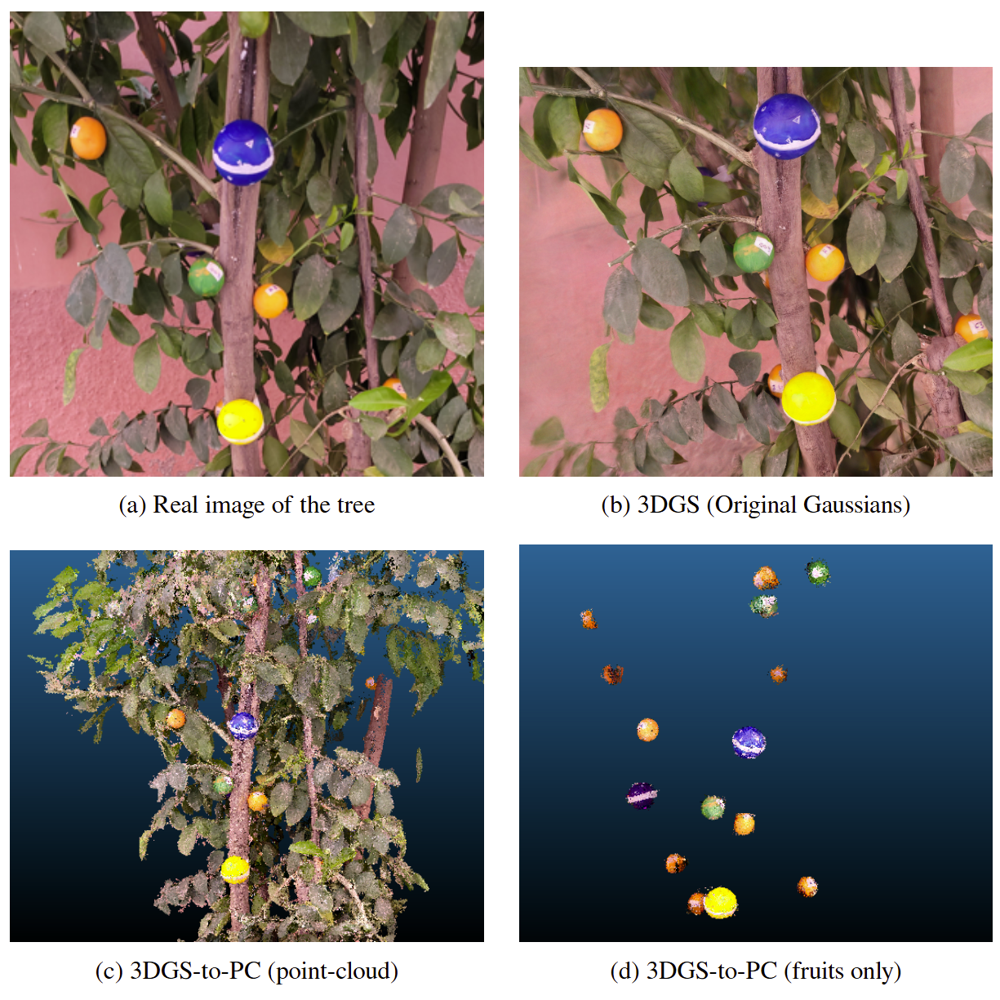

**Mechanism :**  
- Each Gaussian has parameters describing its **position, scale, orientation, opacity, and color** (via spherical harmonics).  
- Training alternates between **rendering**, **error evaluation**, and **parameter updates** to minimize reprojection loss across all views (photometric similarity with the input aligned images).  
- **Increased densification** so that more Gaussians were allocated around the fruits for detailed coverage. 
- **Made low-opacity Gaussians pruning stronger** to remove background noise and redundant splats.  
- After optimization, the model is **converted into a dense point cloud** through a sampling process known as **3DGS-to-PC**, where each Gaussian is projected into 3D space and sampled according to its covariance and opacity.  
  This yields a detailed point cloud that preserves both the **metric geometry** and **local texture fidelity** of the scene.

  

**SuGaR Extension:**  
An improved version of 3DGS, **SuGaR (Surface-Aligned Gaussian Splatting)**, adds a **surface-regularization term** to keep Gaussians tightly aligned to object surfaces.  
This alignment significantly improves the **geometric accuracy** of curved fruits and ensures **smoother, more realistic reconstructions**, ideal for precise diameter estimation.

  

---

### 🍊 3D Fruit Instance Separation (HDBSCAN Clustering)

**Goal:**  
Automatically isolate each fruit within the reconstructed point cloud for independent diameter estimation.

**Input:**  
Dense 3D point cloud (`.ply`) from MVS or 3DGS.

**Output:**  
Stable fruit clusters (`cluster_00.ply`, `cluster_01.ply`, …), each representing a single fruit.

  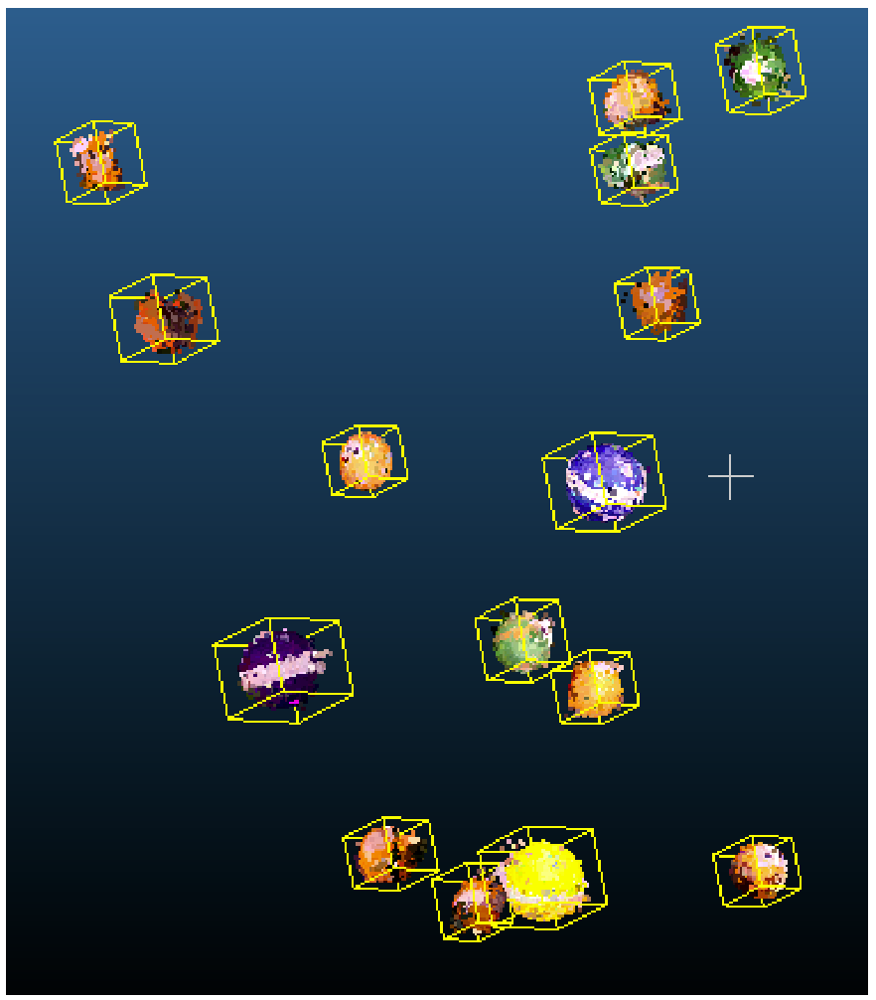

**Mechanism :**  
We adopted **HDBSCAN**, which automatically adapts to local density variations:  
- Builds a hierarchy of clusters across multiple density thresholds.  
- Extracts the most persistent (stable) clusters.  
- Marks low-stability points as noise, effectively removing background artifacts.  
This approach produces clean, consistent clusters that can be directly used for scaling and diameter measurement without manual editing.

---

### 🎨 Extracting the Scaling Cluster

**Goal:**  
Identify the cluster of the **reference sphere** used for metric scaling.

**Input:**  
All clusters (3D point clouds).

**Output:**  
One isolated cluster corresponding to the colored reference sphere.

**Mechanism :**  
The reference sphere was chosen with a distinct color (blue) to simplify detection.  
We filtered clusters based on color distribution to isolate the scaling sphere automatically, ensuring a clean and reliable scale reference for the next stage.

---

### 📏 Scaling to Metric Units

**Goal:**  
Convert the reconstructed 3D cloud from relative units to real-world millimeters.

**Input:**  
Cluster of the reference sphere (known real diameter).

**Output:**  
Scaled 3D point cloud (all dimensions in millimeters).

  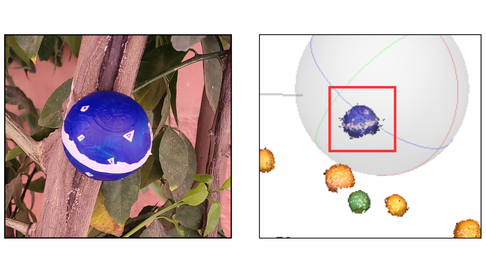

**Mechanism :**  
1. Fit a sphere to the reference cluster and measure its reconstructed diameter.  
2. Compare with the known real diameter.  
3. Compute the scaling factor and apply it to the entire cloud.  
This yields a **metrically consistent reconstruction** ready for accurate fruit sizing.  

---

### ⚪ Fruit Fitting and Measurement

**Goal:**  
Estimate the diameter of each fruit using geometric fitting.

**Input:**  
Individual fruit clusters (scaled point clouds).

**Output:**  
Estimated diameters in millimeters.

**Mechanism :**  
- Fit a **sphere model** to each cluster using **RANSAC**, minimizing point-to-surface distance.  
- Ellipsoid fitting was tested but proved unstable under partial visibility.  
- Sphere fitting remains more consistent and realistic when only part of the fruit is visible, preserving true geometry for diameter estimation.

  

---

### 👁️ Visibility Check

**Goal:**  
Quantify how much of each fruit’s surface was visible in the reconstruction — a key factor for accuracy assessment.

**Input:**  
Fruit cluster (point cloud) + fruit radius.

**Output:**  
Visibility ratio (%) per fruit.

**Mechanism :**  
- Generate an **icosphere** (triangular spherical mesh) with radius = real fruit radius.  
- Fit its center inside the reconstructed cluster.  
- For each 3D point, mark the nearest icosphere face as observed.  
- Compute visibility = (observed faces) / (total faces).  
This gives a clear measure of how complete each fruit’s reconstruction is and how reliable its estimated diameter will be.

  

---

## 📊 Results and Analysis

This section summarizes the behavior and comparative performance of each 3D reconstruction method under different filming conditions, as well as the final accuracy of the full pipeline.

### Our Dataset :

  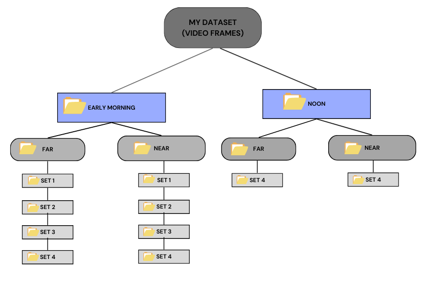

### 🟠 Findings on Structure-from-Motion:

**Using full images vs segmented:**  
  - Using only fruit pixels for alignment fails (too few features).  
  - Full images must be used for camera alignment, while segmentation is applied **later** for dense reconstruction.

**Filming distance matters:**  
  - Near-tree scans produce many fine-texture keypoints → strong matches → accurate geometry.  
  - Far-tree scans give higher overlap but fewer details, causing weak alignment and sparse, unreliable clouds.

  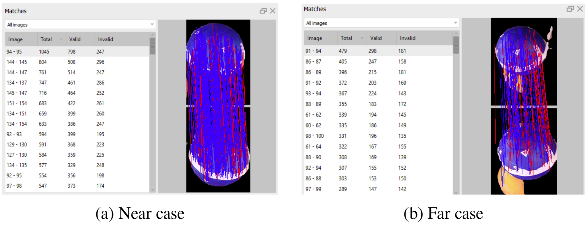 
  <em>Comparison of number of matched features: near vs. far filming distance.</em>

  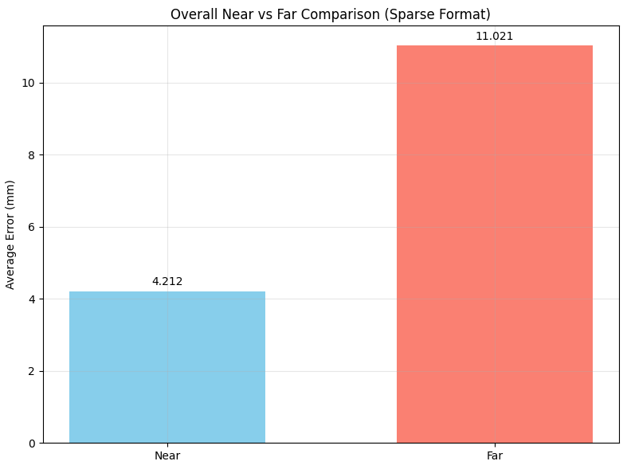 

**Light variation:**  
  - SfM (based on SIFT) is stable under illumination changes — unaffected by morning vs noon lighting.  

✅ **Takeaway:** SfM is geometrically reliable but too sparse for detailed fruit geometry. It performs best with close-range scans and full-frame inputs.

---

### 🔷 Findings on PatchMatch-MVS

**Lighting sensitivity:**  
- Strong light variations cause mismatched depth hypotheses, leading to **duplicated fruits** or geometric artifacts under harsh noon sunlight.  

  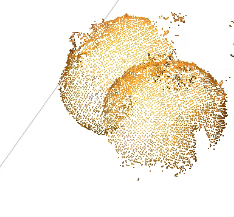
   
  <em>Figure – PatchMatch-MVS under strong illumination variation: duplicated fruit artifacts.</em>

To investigate this issue, we **reprojected the duplicated 3D points** back onto their original 2D images using the known camera parameters.  
The analysis showed that **one part of each duplicated fruit** was reprojected onto masks of images with **high luminance**, while the **other part** appeared on images with **low luminance**.  
This confirms that **photometric inconsistency** between bright and dark frames caused the reconstruction errors.

  
   
  <em>Figure – Reprojection analysis of duplicated MVS points under varying brightness levels.</em>

**Results on different visibility levels:**  
- Accuracy correlates directly with visibility — low-visibility fruits lead to distorted or incomplete clusters.  

  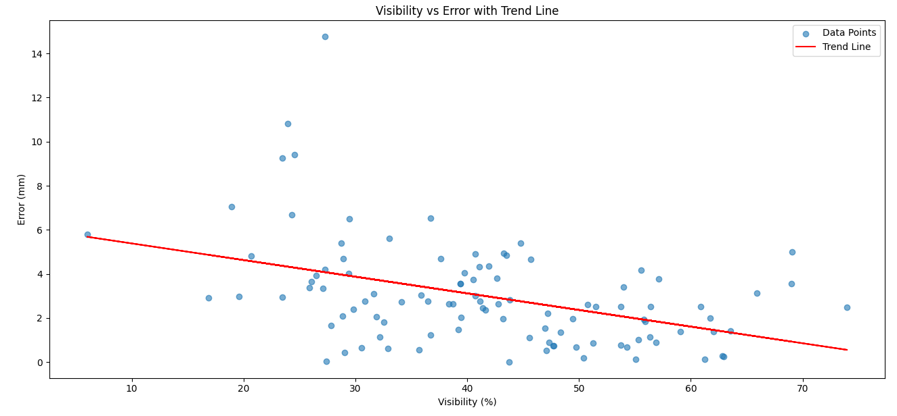 
  <em>high luminance and low luminance groups of pics.</em>

**Density:**  
- Produces a **much denser** and more realistic cloud than SfM, allowing better diameter fitting.

  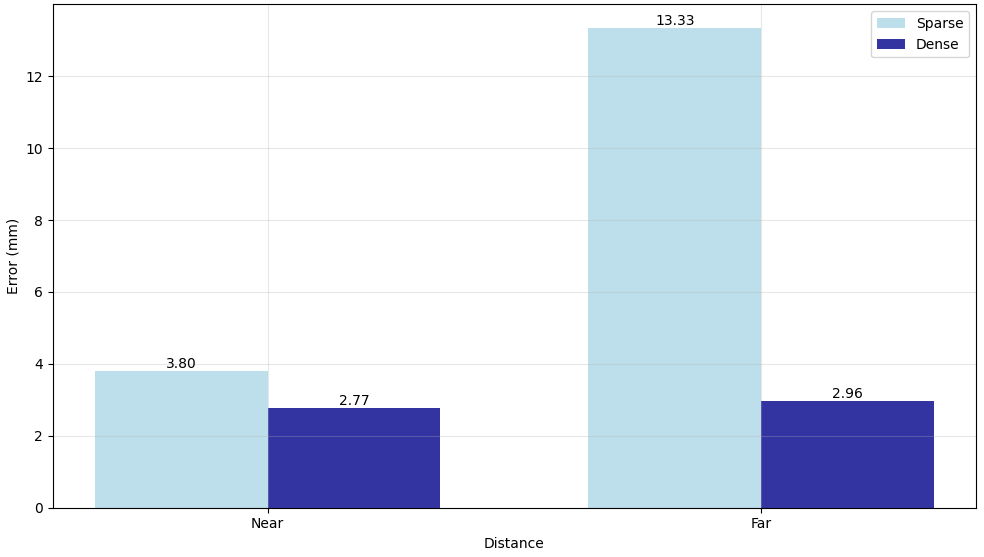 

✅ **Takeaway:** PatchMatch-MVS greatly improves detail over SfM cloud alone but is **sensitive to illumination** and **depends heavily on visibility**.

---

### 🟢 Findings on 3D Gaussian Splatting (3DGS)

**Lighting robustness:**  
- Performs consistently in both morning and noon conditions — spherical harmonics make it **resistant to illumination changes**.  

**Scene coverage and visibility:**  
- Captures **more fruits** geometry than MVS, producing a denser and more complete 3D cloud.  
- Reconstructed fruits achieve up to **88% visibility** (as measured in the visibility estimation stage), far exceeding the coverage achieved by MVS.  

  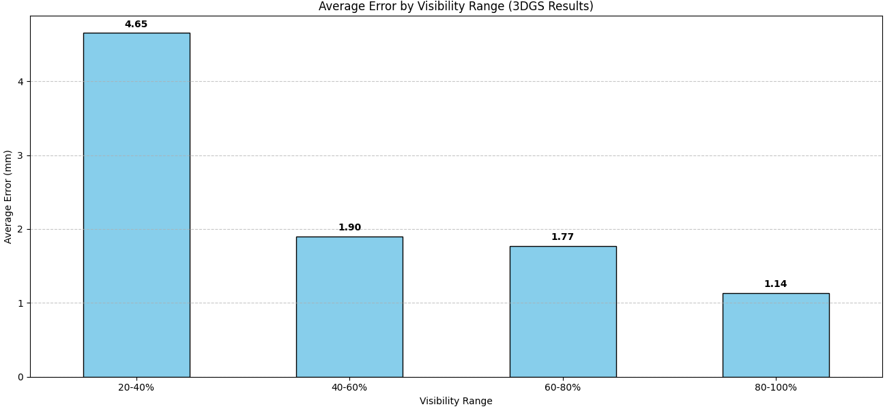 

**Diameter estimation performance:**  
- Thanks to its higher density and consistency, 3DGS yields **more accurate fruit diameter estimates** than PatchMatch-MVS.  

  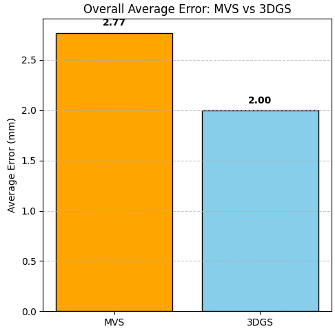 

✅ **Takeaway:** 3DGS outperforms MVS in **coverage**, **lighting robustness**, and **diameter estimation accuracy**, offering a fuller and more reliable 3D reconstruction of the fruits.

---

### 🔵 Findings on SuGaR (Surface-Aligned 3DGS)

- Produces **cleaner, surface-oriented** reconstructions with fewer floating artifacts.  
- Especially beneficial for **distant fruits**, where perspective changes are smaller and 3DGS alone tends to produce noisy splats.  
- For well-visible fruits, results are similar to 3DGS, but SuGaR yields smoother, more stable geometry under challenging visibility.

  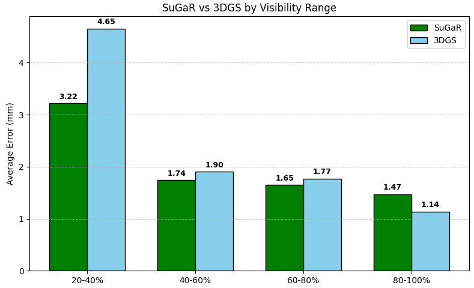 

  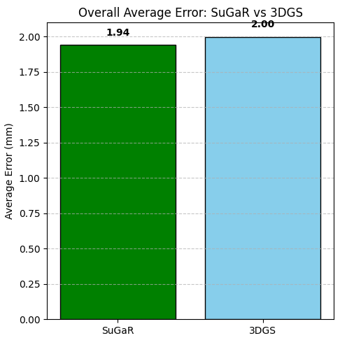 

✅ **Takeaway:** SuGaR enhances 3DGS by enforcing **surface consistency**, improving accuracy on **occluded or far fruits**.

---

### ⚙️ Quantitative Evaluation

| Method | Lighting Robustness | Density | Mean Abs. Error (mm) on best conditions (noon and near sets combined)  |
|---------|---------------------|----------|----------------------|
| **SfM** | ✅ Strong | ⚠️ Sparse | **4,21 mm** | 
| **PatchMatch-MVS** | ⚠️ sensitive | ✅ Dense | **2,77 mm** | 
| **3DGS** | ✅ Strong | ✅ Very Dense | **2.0 mm** |
| **SuGaR** | ✅ Strong | ✅ Very Dense + Cleaner | **1.94 mm**

---

### 🧠 Key Insights

- **Stay close** to the tree: fine texture is more valuable than image overlap.  
- **Use full images** for SfM alignment, not masked ones.  
- **SfM** gives the geometric base; **MVS** improves density but fails under strong light.  
- **3DGS** handles illumination changes and recovers more fruits.  
- **SuGaR** provides the cleanest and most reliable surface reconstructions — especially for distant or occluded fruits.

✅ **Best combination:**  
**SfM for alignment + SuGaR for dense reconstruction** → most robust, accurate, and visually consistent solution for on-tree fruit sizing.

